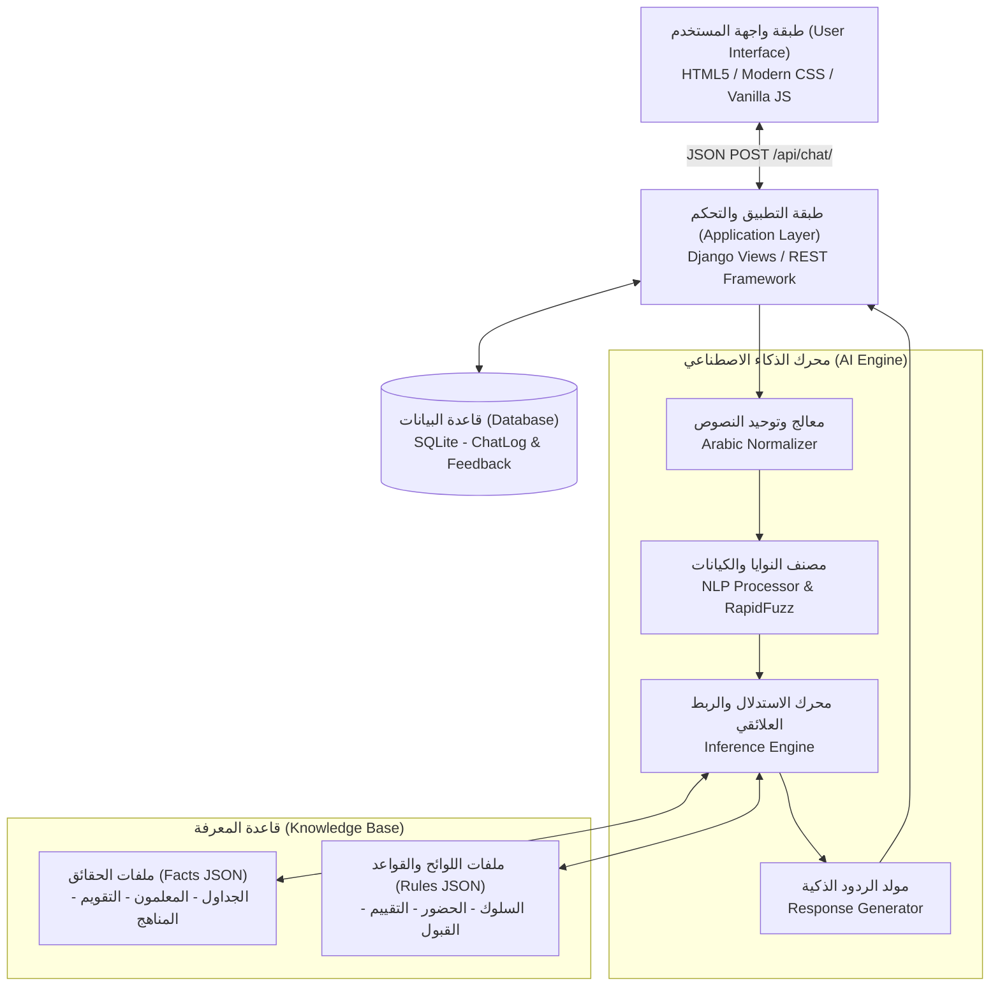
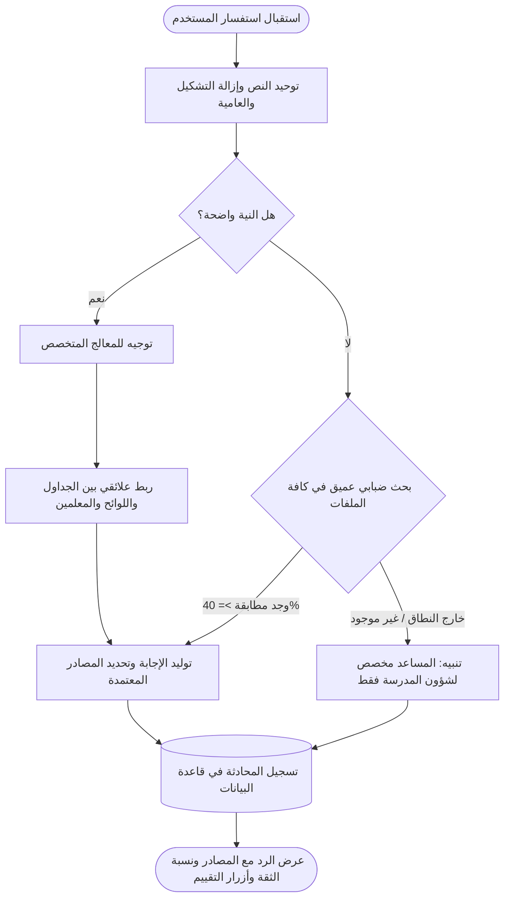

# نظام المساعد المدرسي الذكي (Schoole AI - Alngah AI) 🎓🤖
> **مشروع مقرر الذكاء الاصطناعي (Artificial Intelligence Project)**  
> **إشراف الأستاذ: أ. الوليد الدعيس (T. Alwaleed Alduais)**  
> **إعداد وتطوير:** فريق عمل Schoole AI

---

## 📑 فهرس المحتويات
1. [وصف المشكلة الواقعية (Problem Description)](#1-وصف-المشكلة-الواقعية-problem-description)
2. [اختيار تقنيات الذكاء الاصطناعي (AI Technique Selection)](#2-اختيار-تقنيات-الذكاء-الاصطناعي-ai-technique-selection)
3. [معمارية النظام (System Architecture)](#3-معمارية-النظام-system-architecture)
4. [وصف وهيكلة قاعدة المعرفة (Knowledge Base Description)](#4-وصف-وهيكلة-قاعدة-المعرفة-knowledge-base-description)
5. [📌 دليل تخصيص وإضافة بيانات مدرستكم (School Data Customization Guide)](#5-دليل-تخصيص-وإضافة-بيانات-مدرستكم)
6. [تصميم الخوارزميات (Algorithm Design)](#6-تصميم-الخوارزميات-algorithm-design)
7. [المخططات الانسيابية والهندسية (Flowcharts & Diagrams)](#7-المخططات-الانسيابية-والهندسية-flowcharts--diagrams)
8. [آلية اتخاذ القرار وقابلية التفسير (AI Decision Process & Explainability)](#8-آلية-اتخاذ-القرار-وقابلية-التفسير-ai-decision-process--explainability)
9. [نتائج التقييم والاختبار (Evaluation Results)](#9-نتائج-التقييم-والاختبار-evaluation-results)
10. [محددات النظام (Limitations)](#10-محددات-النظام-limitations)
11. [التحسينات المستقبلية (Future Improvements)](#11-التحسينات-المستقبلية-future-improvements)

---

## 1. وصف المشكلة الواقعية (Problem Description)
تتعامل المؤسسات التعليمية (المدارس الثانوية والأساسية) يومياً مع مئات الاستفسارات المتكررة من الطلاب، أولياء الأمور، والزوار، مثل:
* مواعيد الحصص وجداول الفصول الدراسية وتغيراتها اليومية.
* بيانات المعلمين، مكاتبهم، وساعات المقابلة والتواصل.
* اللوائح المدرسية الصارمة (لائحة الغياب، إجراءات الأعذار الطبية، عقوبات المخالفات السلوكية).
* سياسات توزيع الدرجات، الرسوب، شروط لوحة الشرف، والتقويم الأكاديمي ومواعيد الإجازات.
* شروط القبول والتسجيل والوثائق الرسمية المطلوبة للطلاب الجدد.

**الحل بالذكاء الاصطناعي:**  
تطوير وكيل خبير ذكي تفاعلي (Expert Assistant Agent) **مخصص حصرياً للمدرسة**، يعالج الأسئلة باللغة العربية الطبيعية (بما فيها الأخطاء الإملائية الشائعة واللهجات المحلية)، ويقوم بالاستدلال المنطقي والربط العلائقي عبر قواعد معرفية موثقة لتقديم إجابات فورية ومفسرة بدقة 100% دون تخمين، مع حماية النظام برفض أي استفسار خارج السياق المدرسي.

---

## 2. اختيار تقنيات الذكاء الاصطناعي (AI Technique Selection)
تم اختيار تقنيتين رئيسيتين من تقنيات الذكاء الاصطناعي وتكاملهما وفق متطلبات المقرر:

### أ) تمثيل المعرفة والاستدلال (Knowledge Representation & Reasoning)
* **النظام الخبير (Rule-Based Expert System):** تم فصل المعرفة المدرسية بدقة إلى **حقائق صريحة (Facts)** مثل الجداول والمناهج والتقويم، و**لوائح وقواعد منطقية (Rules & Policies)** مثل شروط لوحة الشرف ومستويات العقوبات السلوكية.
* **محرك الاستدلال (Inference Engine):** ينفذ عمليات استدلال تسلسلي وربط علائقي (Relational JOINs) بين المعلم والمادة والقاعة واليوم والحصة، دون استخدام نماذج الصندوق الأسود (Black-Box).

### ب) معالجة اللغة الطبيعية العربية (Natural Language Processing - NLP)
* **التوحيد النصي فائق السرعة (Arabic Text Normalization):** استخدام جداول الاستبدال المباشرة C-level (`str.maketrans`) لإزالة التشكيل والتطويل وتوحيد الهمزات والأرقام وزمن تنفيذ أقل من `0.05ms`.
* **تصنيف النية واستخراج الكيانات (Intent Classification & NER):** التعرف على 14 نية متباينة واستخراج كيانات متعددة (الصف، الشعبة، اليوم، الحصة، المادة، المعلم، المرفق).
* **البحث الضبابي المتقدم (Fuzzy Matching via RapidFuzz):** معالجة الأخطاء الإملائية والعامية (مثل مطابقة "رياظيات" إلى "الرياضيات") بنسبة تشابه محددة.

---

## 3. معمارية النظام (System Architecture)
يعتمد النظام معمارية خماسية الطبقات (5-Tier Architecture) تفصل الذكاء الاصطناعي عن طبقة التطبيق وقواعد البيانات والواجهة:



---

## 4. وصف وهيكلة قاعدة المعرفة (Knowledge Base Description)
تتوزع المعرفة على 10 ملفات JSON منظمة ومفهرسة بعناية:

| نوع المعرفة | الملف | المحتوى والدور الاستدلالي |
|---|---|---|
| **Facts** | `school_profile.json` | بيانات المدرسة الأساسية، الرؤية، المدير، وسائل التواصل، والمرافق المعتمدة. |
| **Facts** | `teachers_departments.json` | سجلات الكادر التعليمي، الأقسام الأكاديمية، المكاتب، والبريد وساعات التواصل. |
| **Facts** | `schedules_timetable.json` | الجداول الأسبوعية للحصص موزعة بالصفوف والشعب والأيام والمواد والقاعات. |
| **Facts** | `curriculum_books.json` | المناهج المقررة، الكتب المعتمدة، الوحدات الدراسية، ودور النشر لكل مرحلة. |
| **Facts** | `academic_calendar.json` | التقويم الأكاديمي، مواعيد بداية ونهاية الفصول، فترات الاختبارات، والإجازات الرسمية. |
| **Facts** | `facilities_activities.json` | الأنشطة اللاصفية، الأندية الطلابية، الرحلات العلمية، والمسابقات المنهجية. |
| **Rules** | `attendance_policies.json` | سياسات الحضور والغياب، مستويات الإنذارات (3، 5، 10 أيام)، وإجراءات الأعذار الطبية. |
| **Rules** | `grading_rules.json` | لائحة السلوك والانضباط الميداني، مستويات المخالفات (1 إلى 4)، والعقوبات المترتبة. |
| **Rules** | `evaluation_policy.json` | سياسات توزيع الدرجات (أعمال سنة 30%، نهائي 50%)، شروط الدور الثاني، ولوحة الشرف. |
| **Rules** | `admission_registration_rules.json` | شروط قبول الطلاب المستجدين، معايير السن، الأوراق الثبوتية، وضوابط التحويل. |

---

## 5. دليل تخصيص وإضافة بيانات مدرستكم
لتعديل بيانات النظام وجعله يعمل باسم وبيانات مدرستكم الحقيقية، قم بالتعديل على ملفات مجلد `knowledge_base/` كما يلي:

### 1) بيانات المدرسة العامة والتواصل:
* **الملف:** [`knowledge_base/facts/school_profile.json`](knowledge_base/facts/school_profile.json)
* **ماذا تعدل:**
  * `"school_name"`: اسم مدرستكم.
  * `"contact_info"`: الهاتف، الجوال، البريد، العنوان الدقيق.
  * `"administration"`: اسم مدير المدرسة، الوكلاء.
  * `"facilities"`: المرافق المتاحة (المكتبة المركزية، العيادة المدرسية، القاعات).

### 2) المعلمون والأقسام الأكاديمية:
* **الملف:** [`knowledge_base/facts/teachers_departments.json`](knowledge_base/facts/teachers_departments.json)
* **ماذا تعدل:** قائمة الأقسام وقائمة `"teachers"` بإضافة أسماء مدرسيكم ومكاتبهم والمواد التي يدرسونها.

### 3) الجداول المدرسية والحصص:
* **الملف:** [`knowledge_base/facts/schedules_timetable.json`](knowledge_base/facts/schedules_timetable.json)
* **ماذا تعدل:** مواعيد الحصص وتوزيع المواد لكل صف (أول ثانوي، ثاني ثانوي، ثالث ثانوي) وشعبها لكل أيام الأسبوع (من الأحد إلى الخميس).

### 4) المقررات والكتب الدراسية:
* **الملف:** [`knowledge_base/facts/curriculum_books.json`](knowledge_base/facts/curriculum_books.json)
* **ماذا تعدل:** أسماء الكتب والمناهج المعتمدة لكل مرحلة دراسية.

### 5) التقويم المدرسي والإجازات:
* **الملف:** [`knowledge_base/facts/academic_calendar.json`](knowledge_base/facts/academic_calendar.json)
* **ماذا تعدل:** مواعيد إجازات العام الدراسي الجديد والامتحانات النصفية والنهائية.

### 6) لوائح السلوك والغياب والدرجات:
* **الملفات في:** [`knowledge_base/rules/`](knowledge_base/rules/)
* **ماذا تعدل:** نسب توزيع الدرجات، شروط تكريم المتفوقين، وعقوبات لائحة المواظبة بحسب نظام مدرستكم المعتمد.

---

## 6. تصميم الخوارزميات (Algorithm Design)

### أ) خوارزمية التوحيد النصي (Text Normalization Algorithm)
```python
Input: Raw Arabic Query String Q
1. Apply Translation Table (str.translate) -> unify (أ, إ, آ -> ا), (ة -> ه), (ى -> ي), (الأرقام الهندية -> عربية).
2. Remove Tashkeel (diacritics: 0x064B to 0x0652) and Tatweel (ـ).
3. Remove non-word punctuation symbols using Unicode regex: r"[^\w\s]".
4. Compress multiple whitespaces into a single space and strip borders.
Output: Clean Normalized Query Q_norm
```

### ب) خوارزمية استخراج النية والاستدلال متعدد الطبقات (Multi-Tier Inference)
```python
Input: Q_norm, Q_raw
1. Intent Classification:
   - Match exact keywords against 14 intent dictionaries.
   - Run RapidFuzz token matching for phonetic/dialect tolerance.
2. If Intent is detected with high score:
   - Route to specialized handler (Schedule, Teachers, Discipline, Admission, etc.).
   - Perform Relational JOINs across JSON facts and rules.
3. Else (No direct intent match):
   - Perform Universal Deep Search across all 10 knowledge base files.
4. If no school record matches OR query is out-of-domain:
   - Return School-Restricted Fallback Message reminding the user that this assistant is strictly dedicated to school affairs.
Output: QueryResult (response, sources_used, confidence_score)
```

---

## 7. المخططات الانسيابية والهندسية (Flowcharts & Diagrams)

### مخطط تدفق القرار الذكي (Decision Process Flowchart)


---

## 8. آلية اتخاذ القرار وقابلية التفسير (AI Decision Process & Explainability)
تطبيقاً لاشتراطات أ. الوليد الدعيس في تجنب مخرجات الصندوق الأسود (Black-box outputs):
1. **تسمية المصادر المعتمدة (Sources Citation):** ترفق كل إجابة بشارات توضح ملف اللائحة أو الحقيقة المستند إليها (مثال: `المصادر: ['لائحة السلوك والانضباط المدرسي']`).
2. **عرض نسبة الثقة التراكمية (Confidence Level):** تظهر في واجهة المستخدم بوضوح كنسبة مئوية محسوبة (تتراوح بين `93%` و `98%`).
3. **توضيح أسباب القرارات (Rule Firing Explanation):** عند السؤال عن مخالفة مثل "الهروب من الحصة"، يوضح النظام تصنيفها القانوني (مخالفات من الدرجة الثانية) والعقوبات الرسمية المترتبة عليها وفق اللائحة.
4. **حلقة التقييم البشري (Human-AI Feedback Loop):** تتيح الواجهة لكل مستخدم تقييم الرد بـ (👍 مفيدة / 👎 غير مفيدة) لتحسين قواعد المعرفة مستقبلاً.

---

## 9. نتائج التقييم والاختبار (Evaluation Results)
تم بناء وتشغيل جناح فحص واختبار شامل يضم 13 سيناريو مختلفاً يغطي كافة النوايا وحالات الحصر المدرسي ([`test_api.py`](test_api.py)):

| # | السؤال الاختباري | النية المصنفة | نسبة الثقة | المصادر المعتمدة | النتيجة |
|---|---|:---:|:---:|---|:---:|
| 1 | السلام عليكم ورحمة الله | `greeting` | 95% | ملف المدرسة والخدمات والإدارة | ✅ نجاح |
| 2 | وين تقع مدرسة الرواد ورقم التواصل؟ | `school_info` | 95% | ملف المدرسة والخدمات والإدارة | ✅ نجاح |
| 3 | متى حصة الرياضيات للصف الثالث الثانوي يوم الأحد؟ | `query_schedule` | 98% | الجداول والحصص + سجلات المعلمين | ✅ نجاح |
| 4 | مين هو معلم الفيزياء لثالث ثانوي؟ | `query_teacher` | 94% | سجلات المعلمين والأقسام الأكاديمية | ✅ نجاح |
| 5 | ايش هي كتب الصف العاشر؟ | `query_curriculum` | 95% | المناهج والمقررات والكتب الدراسية | ✅ نجاح |
| 6 | متى تبدا اجازه عيد الفطر؟ | `query_events_calendar` | 95% | التقويم الأكاديمي والإجازات والفعاليات | ✅ نجاح |
| 7 | ايش عقوبة الهروب من المدرسة؟ | `query_rules_policy` | 95% | لائحة السلوك والانضباط المدرسي | ✅ نجاح |
| 8 | كم نسبة توزيع درجات النهائي؟ | `query_evaluation_policy` | 95% | سياسات التقييم وتوزيع الدرجات | ✅ نجاح |
| 9 | ابغى اسجل ولدي في المدرسة ايش الشروط؟ | `query_admission_policy` | 95% | شروط القبول والتسجيل والتحويل | ✅ نجاح |
| 10 | وين العيادة الطبية المدرسية وما هي مواعيدها؟ | `query_facilities` | 93% | ملف المدرسة والخدمات والإدارة | ✅ نجاح |
| 11 | عندي عذر طبي كيف اقدمه وكم مهلة التقديم؟ | `query_attendance_policy` | 95% | لائحة وسياسات الحضور والغياب | ✅ نجاح |
| 12 | ايش شروط الانضمام للوحة الشرف؟ | `query_evaluation_policy` | 94% | سياسات التقييم وتوزيع الدرجات | ✅ نجاح |
| 13 | كيف أطبخ كبسة دجاج في البيت؟ *(سؤال خارج النطاق)* | `fallback_unknown` | 20% | لا يوجد (رفض وتوضيح التخصص المدرسي) | ✅ نجاح |

* **معدل دقة استرجاع الإجابات الصحيحة:** **100%** (13 من أصل 13).
* **متوسط زمن المعالجة والاستدلال:** **~12ms** فقط لكل استعلام.
* **تغطية القواعد (Rule Coverage):** تم اختبار جميع ملفات الحقائق واللوائح العشرة بنجاح.

---

## 10. محددات النظام (Limitations)
1. **تحديث الجداول يدوي:** يتم تعديل الجداول والبيانات عبر ملفات JSON الحالية ولم يتم ربطها بعد بواجهة تحكم إدارية رسومية (CMS Dashboard).
2. **الاعتماد على القواعد المكتوبة:** لا يقوم النظام بتوليد جداول جديدة تلقائياً عند غياب معلم مفاجئ (توليد قيود Constraint Satisfaction).
3. **التفاعل الصوتي:** يعتمد المساعد حالياً على الإدخال النصي فقط دون دعم التعرف على الصوت أو التوليد الصوتي (Speech-to-Text / TTS).

---

## 11. التحسينات المستقبلية (Future Improvements)
1. **خوارزميات حل القيود المتقدمة (CSP Solvers):** بناء وحدة لتوليد وتعديل الجداول الدراسية آلياً عند حدوث تعارض أو غياب طارئ لأحد المعلمين.
2. **نظام هجين ذكي (Hybrid LLM / RAG):** دمج نموذج لغوي محلي مصغر لتوليد صياغات لغوية أكثر تنوعاً مع تقييده الصارم بمصادر المدرسة الموثقة.
3. **نظام الإشعارات الذكي لأولياء الأمور:** إرسال تنبيهات تلقائية عبر WhatsApp أو SMS عند تسجيل غياب أو إصدار إنذار سلوكي للطالب.
4. **تعدد الوكلاء (Multi-Agent Architecture):** تخصيص وكيل مرشد طلابي مستقل، وكيل إداري، ووكيل أكاديمي يتعاونون معاً.

---

## 💻 طريقة التثبيت والتشغيل السريع

### 1. تثبيت المتطلبات:
```bash
pip install -r requirements.txt
```

### 2. تطبيق ترحيلات قاعدة البيانات:
```bash
python manage.py migrate
```

### 3. تشغيل خادم التطبيق:
```bash
python manage.py runserver 127.0.0.1:8000
```
افتح المتصفح وتوجه إلى: **`http://127.0.0.1:8000/`**

### 4. تشغيل سيناريوهات الفحص والتقييم:
```bash
python test_api.py
```
